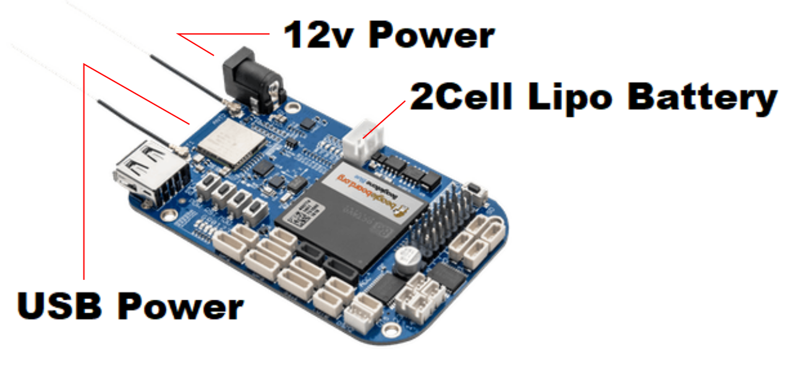

# Getting Started with Beaglebone Blue


Beaglebone Blue is a linux debian base OS device that allow user player around with robotic stuff. There are 3 ways to powering the board. You can plug all 3 power sources at the same time without any problem.

## Update BBB debian
- BBB can be run from 2 storage sources: SD Card and eMMC (embedded Mutli Media Card)(storage that directly solder onto board).
- Out of the box, BBB already has a pre-installed debian OS where user can easily use it right away.
- In a condition where we need to update the debian, we can follow the instruction below.

### Images Download
| MATLAB | Image Link : https://beagleboard.org/latest-images |
| --- | --- |
| [Debian 9.5 2018-10-07 4GB SD IoT](https://debian.beagleboard.org/images/bone-debian-9.5-iot-armhf-2018-10-07-4gb.img.xz)| is type of the Image that allow the BBB directly boot from the SD card |
| Debian 9.5 2018-10-07 4GB SD IoT eMMC flasher | is type of the Image that require the BBB to flash the eMMC before use |


### Flash Image eMMC flasher
- Download [BalenaEtcher](https://www.balena.io/etcher/)
- Flash the downloaded Image to the SD card using BalenaEtcher
- Put SD card into the BBB card slot
- Hold SD button on the BBB while connect it to the PC
- Wait until the LED flashing then release the SD button
- When new storage appear on the PC, the BBB is ready to use
### Flash Image non eMMC flasher
Follow the precedure from Flash Image eMMC flasher section
- Connect to the BBB via browser Cloud9 IDE address : 192.168. 7.2:3000
- Navigate to /opt/scripts/tools/eMMC
```
$ cd
$ cd opt/scripts/tools/eMMC
```
Execute init-eMMC-flasher-v3.sh
```
$ sudo ./init-eMMC-flasher-v3.sh
```
- BBB will start to go in to flashing mode. Do not disconnect the power.
- Wait until the LED completely shutdown then unplug the power and replug back in.

### Connect BBB to WIFI
On Terminal Cloud9 IDE
```
$ connmanctl
$ tether wifi off
$ enable wifi
$ scan wifi
$ services
$ agent on
$ connect {wifi name ex:wifi_f45eab_.................}
$ password
$ exit
```
#### All set. Let get start to play arround with the board.

### Auto Execute Program on Startup
Reference [Link1](https://stackoverflow.com/questions/28854705/executing-a-script-on-startup-using-beaglebone-black) | [Link2](https://gist.github.com/tstellanova/7323116)

| Instruction | Command |
|------------ | --------|
| Go to /usr/bin | `$ cd /usr/bin `|
| Create sh file | `$ touch myfunction.sh`|
| Edit the file content | `$ nano myfunction.sh`|
| In file content, Put in | `#!/bin/bash`<br />`cd ~/folder/ # this line is go to the directory of the executable code`<br />`./funtion # this line is for executing the programe (can be sudo python3 function.py)` |
| Save and Make the file executable | `$ sudo chmod u+x myfunction.sh` |


### Shutdown BBB
```
$ sudo shutdown now
```
